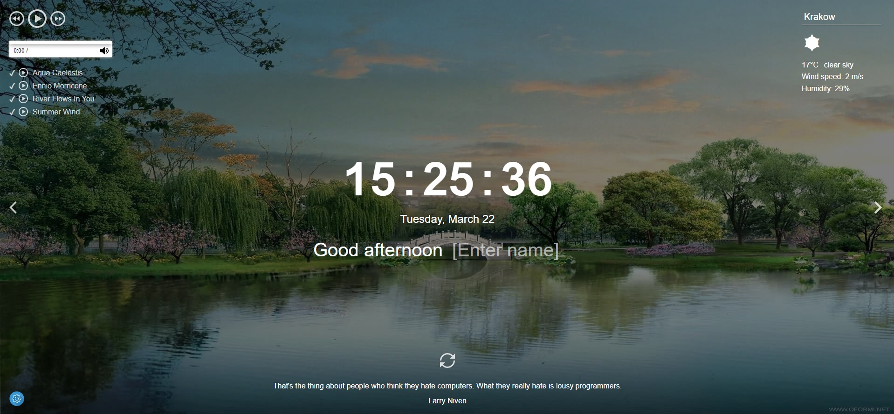

# Momentum

**Momentum** is similar to the Chrome Web Store [application](https://chrome.google.com/webstore/detail/momentum/laookkfknpbbblfpciffpaejjkokdgca?hl=ru). It shows the time and user name. The background image and greeting changes depending on the time of day. The application has a clock, an image slider, weather widget, an audio player, a quote of the day block and settings. Local storage is used to store the username and location.

### Key skills:

- methods of searching for elements;
- data output to the page;
- work with date and time;
- work with audio;
- saving data in local storage;
- use of recursive setTimeout;
- division of js-code into modules;
- work with asynchronous requests.

### https://kykysja-momentum.netlify.app
